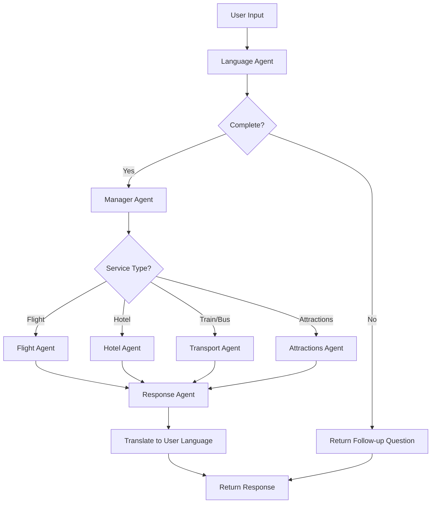
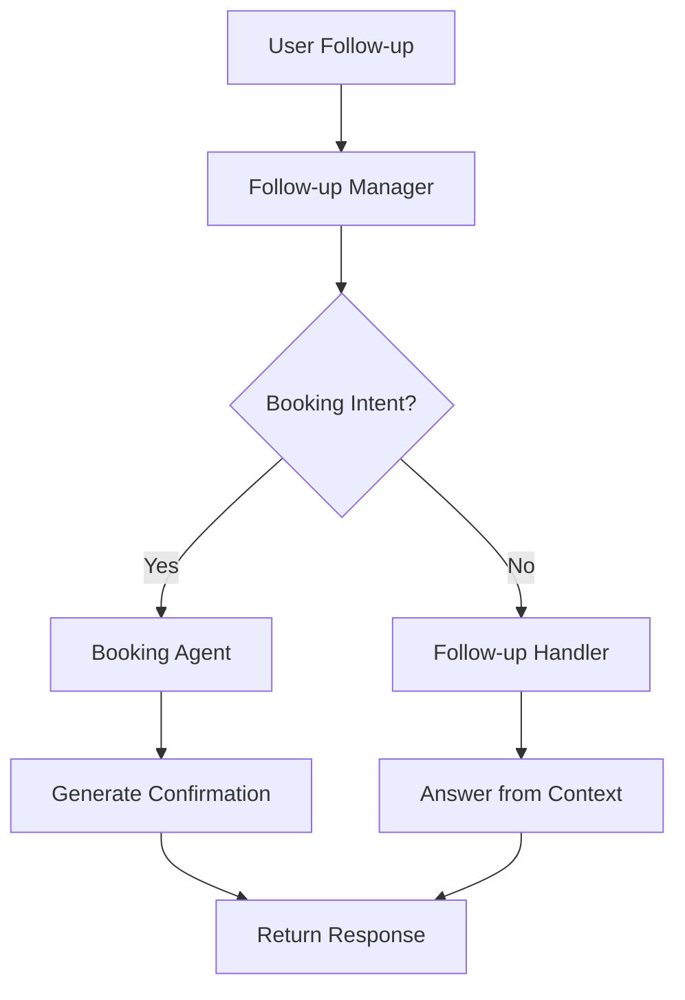

# ✈️ Multi-Lingual Travel Assistant

An intelligent, multi-lingual AI travel assistant powered by CrewAI, Google Gemini, and EXA Search. The system supports natural language queries in multiple Indian languages and English, provides real-time travel search results, and includes mock booking functionality.

---

## 🌟 Features

### Core Capabilities

- **Multi-Language Support**: Hindi, Marathi, Tamil, Bengali, English, etc
- **Intelligent Language Detection**: Automatic detection and translation
- **Hierarchical Agent System**: Specialized agents for different travel services
- **Real-time Search**: Powered by EXA Search API
- **Context-Aware Conversations**: Session-based memory management
- **Mock Booking System**: Generate realistic booking confirmations
- **Follow-up Query Handling**: Answer questions about search results

### Travel Services

- ✈️ **Flight Search**: Find flights with prices, timings, and airlines
- 🏨 **Hotel Search**: Discover accommodations with ratings and amenities
- 🚆 **Train Search**: Browse train schedules and classes
- 🚌 **Bus Search**: Find bus routes and timings
- 🎭 **Attractions**: Get local recommendations and tourist spots
- 📋 **Booking**: Mock booking confirmations with PNR/booking IDs

### User Experience

- **Toggle Query Mode**: Switch between new queries and follow-up questions
- **Session Management**: Load and manage multiple conversation sessions
- **Detailed Analytics**: View agent outputs, search results, and conversation history
- **Responsive UI**: Built with Streamlit for seamless interaction

---

## 🛠️ Tech Stack


| Component | Technology | Purpose |
|-----------|-----------|---------|
| **AI Framework** | CrewAI | Multi-agent orchestration |
| **LLM** | Google Gemini Flash | Language understanding & generation |
| **Search** | EXA Search API | Real-time travel data retrieval |
| **Backend** | FastAPI | RESTful API server |
| **Frontend** | Streamlit | Interactive web interface |
| **Database** | SQLite | Session & conversation memory storage |
| **Language** | Python 3.9+ | Core application language |

---

## 📁 Project Structure

```
multi-lingual-travel-assistant/
│
├── agents.py                  # Agent definitions (8 specialized agents & 2 Manager agents)
├── tasks.py                   # Task definitions (5 main tasks)
├── crew.py                    # CrewAI orchestration logic
├── main.py                    # FastAPI application & API endpoints
├── app.py                     # Streamlit frontend application
├── memory_manager.py          # SQLite-based memory system
├── tools.py                   # EXA Search tool configuration
├── config.py                  # Environment & application settings
├── logger.py                  # Logging configuration
│
├── .env                       # Environment variables (not in repo)
├── requirements.txt           # Python dependencies
├── README.md                  # This file
│
├── travel_memory.db          # SQLite database (auto-generated)
```

### File Responsibilities

| File | Purpose |
|------|---------|
| `agents.py` | Defines 8 specialized agents with roles and backstories & 2 Manager agents |
| `tasks.py` | Defines tasks for language detection, search, response, follow-up, booking |
| `crew.py` | Orchestrates agents based on query type (initial/follow-up/booking) |
| `main.py` | FastAPI server with `/api/chat` and session management endpoints |
| `app.py` | Streamlit UI with session management and query mode toggle |
| `memory_manager.py` | Custom SQLite memory with sessions, messages, agent_outputs tables |
| `tools.py` | Configures EXA Search tool with content and summary features |
| `config.py` | Loads environment variables and validates API keys |
| `logger.py` | Structured logging for debugging and monitoring |

---

## 🚀 Installation

### Prerequisites

- Python 3.11 or higher
- pip package manager
- API Keys:
  - Google Gemini API Key
  - EXA Search API Key

### Step-by-Step Setup

**1. Clone the Repository**
```bash
git clone https://github.com/omkardev7/Travel_AI_Assistance.git

cd Travel_AI_Assistance
```

**2. Create Virtual Environment**
```bash
python -m venv venv

# On Windows
.\venv\Scripts\Activate.ps1

# On macOS/Linux
source venv/bin/activate
```

**3. Install Dependencies**
```bash
pip install -r requirements.txt
```

**4. Create `.env` File**
```bash
touch .env
```

Add the following to `.env`:
```env
# Required API Keys
GEMINI_API_KEY=your_gemini_api_key_here
EXA_API_KEY=your_exa_api_key_here

# Optional Configuration
API_HOST=0.0.0.0
API_PORT=8000
LOG_LEVEL=INFO
CREWAI_TRACING_ENABLED=false
```

---

## ⚙️ Configuration

### Environment Variables

| Variable | Required | Default | Description |
|----------|----------|---------|-------------|
| `GEMINI_API_KEY` | ✅ Yes | - | Google Gemini API key |
| `EXA_API_KEY` | ✅ Yes | - | EXA Search API key |
| `API_HOST` | ❌ No | `0.0.0.0` | FastAPI host address |
| `API_PORT` | ❌ No | `8000` | FastAPI port number |
| `LOG_LEVEL` | ❌ No | `INFO` | Logging level (DEBUG/INFO/WARNING/ERROR) |
| `MEMORY_DB_PATH` | ❌ No | `travel_memory.db` | SQLite database path |


---

## 📖 Usage

### Starting the Application

**1. Start the FastAPI Backend (Terminal 1)**
```bash
python main.py
```
The API will be available at: `http://localhost:8000`

**2. Start the Streamlit Frontend (Terminal 2)**
```bash
streamlit run app.py
```
The UI will open in your browser at: `http://localhost:8501`

### Basic Workflow

**Step 1: Create or Load Session**
- Click "➕ New Session" to start fresh
- Or enter an existing session ID to continue

**Step 2: Choose Query Mode**
- **New Query Mode** (`is_followup=False`): Start a fresh travel search
- **Follow-up Mode** (`is_followup=True`): Ask about existing results

**Step 3: Send Your Query**

Examples:
```
New Query Mode:
"मुझे 10/12/2025 पुणे से दिल्ली  जाने के लिए ट्रेन का विकल्प बताइए। मैं अकेला व्यक्ति हूँ और मेरा बजट 10000 है।"
"Please tell me the train option to go from Pune to Delhi on 10/12/2025. I am a single person and my budget is 10000."

Follow-up Mode:
"सबसे सस्ता विकल्प कौन सा है" (Which is the cheapest option?)
"दूसरा बुक करें - नाम: जॉन डो, संपर्क: 9876543210, ईमेल: test@tes.com (Book the second one - Name: John Doe, Contact: 9876543210, email: test@tes.com)"
```

**Step 4: Review Results**
- View search results translated to your language
- Toggle follow-up mode to ask questions
- Proceed with booking if desired

---

## 🔌 API Documentation

### Endpoints

#### POST `/api/chat`

Main chat endpoint for processing user queries.

**Request Body:**
```json
{
  "session_id": "optional-session-id",
  "message": "मुंबई ते दिल्ली फ्लाइट",
  "is_followup": false
}
```

**Response:**
```json
{
  "session_id": "550e8400-e29b-41d4-a716-446655440000",
  "response": "यहाँ मुंबई से दिल्ली की 5 फ्लाइट्स हैं:\n\n1. IndiGo 6E-123...",
  "detected_language": "hi",
  "is_followup": false,
  "is_booking": false,
  "is_complete": true,
  "agents_called": ["language_agent", "flight_agent", "response_agent"],
  "status": "success"
}
```

#### GET `/api/session/{session_id}`

Retrieve complete session information.

**Response:**
```json
{
  "session_id": "550e8400-e29b-41d4-a716-446655440000",
  "language": {
    "detected_language": "hi",
    "language_name": "Hindi"
  },
  "entities": {
    "origin": "Mumbai",
    "destination": "Delhi",
    "date": "tomorrow"
  },
  "conversation_history": [...],
  "search_results": [...],
  "agent_outputs": [...],
  "stats": {
    "message_count": 5,
    "agent_call_count": 12
  }
}
```

#### DELETE `/api/session/{session_id}`

Delete a session and all associated data.

**Response:**
```json
{
  "message": "Session deleted successfully"
}
```

#### GET `/health`

Health check endpoint.

**Response:**
```json
{
  "status": "healthy",
  "service": "travel-assistant",
  "process_type": "hierarchical",
  "memory_system": "optimized SQLite"
}
```

---


## 💾 Memory Management

### Database Schema

The system uses **SQLite** with 3 optimized tables:

#### 1. Sessions Table
```sql
CREATE TABLE sessions (
    session_id TEXT PRIMARY KEY,
    created_at TIMESTAMP DEFAULT CURRENT_TIMESTAMP,
    last_activity TIMESTAMP DEFAULT CURRENT_TIMESTAMP,
    metadata TEXT
)
```

#### 2. Messages Table
```sql
CREATE TABLE messages (
    id INTEGER PRIMARY KEY AUTOINCREMENT,
    session_id TEXT NOT NULL,
    role TEXT NOT NULL,
    content TEXT NOT NULL,
    metadata TEXT,
    timestamp TIMESTAMP DEFAULT CURRENT_TIMESTAMP,
    FOREIGN KEY (session_id) REFERENCES sessions(session_id)
)
```

#### 3. Agent Outputs Table
```sql
CREATE TABLE agent_outputs (
    id INTEGER PRIMARY KEY AUTOINCREMENT,
    session_id TEXT NOT NULL,
    agent_name TEXT NOT NULL,
    task_name TEXT NOT NULL,
    output_type TEXT NOT NULL,
    output_data TEXT NOT NULL,
    timestamp TIMESTAMP DEFAULT CURRENT_TIMESTAMP,
    FOREIGN KEY (session_id) REFERENCES sessions(session_id)
)
```


---

## 🔄 Workflow

### Initial Query Workflow



### Follow-up Query Workflow



---


## 🙏 Acknowledgments

- **CrewAI** - Multi-agent framework
- **Google Gemini** - Language model
- **EXA Search** - Real-time search API
- **FastAPI** - Web framework
- **Streamlit** - UI framework

---